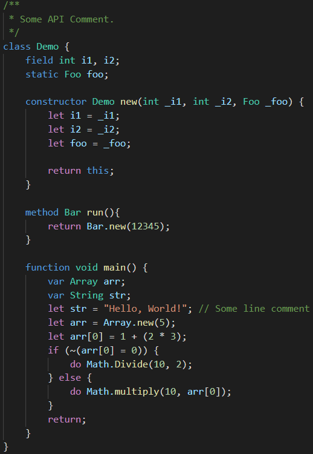

#  Jack Language Support for Visual Studio Code 

Provides syntax highlighting support for the Jack language.

## Features

Here is an example for the syntax highlighting capabilities:

## Requirements

None.

## Extension Settings

None.

## Known Issues

None.

## Release Notes

### 1.0.0

Initial release of this extension.

**Enjoy!**
